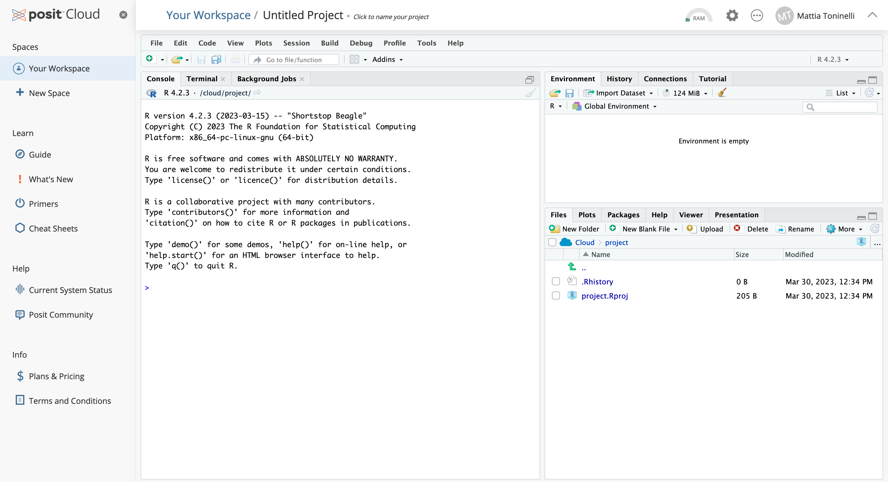

```{r setup, include=FALSE}
knitr::opts_chunk$set(echo = TRUE, fig.align = 'center', warning = FALSE, message = FALSE)
```

## Objectives
- Setup RStudio or Posit
- Get familiar with the Posit interface
- Learn about bulk RNA-seq data processing
- Download the data needed for the workshop

# Setup
## Using Rstudio or Posit
If RStudio is not installed on your computer, you can create a free account on [_posit.cloud_](posit.cloud). Create the account with your credentials and follow the instructions to create a new project. Once done, you should see something like this on your screen:

::: {align="center"}

:::

## Communicating with R
You should see your cursor on the left-hand side of the screen blinking. That window represents the R *_console_*. It can be used to "talk" with R through commands that it can understand!

For example, try typing the following in the console and check what comes out (a.k.a. the _output_):

```{r}
# Tell R to print out some words on screen with the "print" command
print('Hello World!')
```

You have now instructed R to do something for you! We will ask it to do plenty more in the code chunks below!

## Creating a script
In the console we can type as many commands as we want and execute them sequentially. Nevertheless, commands are lost the moment they are executed and if we want to execute them again we need to type everything back in the console... this is painful!

A **script** is just a normal text file which groups a series of commands that R executes sequentially, reading the file line-by-line. This is much better because we can then edit the file and keep save the changes!
Follow the movie below to create an R script in Posit, the same applies to Rstudio.

<center>
<video controls="controls" width="600" height="400" name="Create a script">
  <source src="../pics/script_creation.mov">
</video>
</center>


The new window that appeared on the upper left represents your R script, you can see it from the `.R` file extension at the end. In here we can write R code which DOES NOT get executed immediately like in the console before. 

> 💡
> In order to execute code from the script, highlight the code line you want to execute (or put your cursor line on it) and press <kbd>⌘</kbd>+<kbd>Enter</kbd> on Mac or <kbd>Ctrl</kbd>+<kbd>Enter</kbd> on Windows.

## Installing packages
The analyses that we are going to conduct require specific **packages**. In R, packages are _collections of functions_ which help us perform standardized workflows. In the **code chunk** below, we instruct R to install the packages that we need for the analyses.

> 💡
> Copy and paste _code chunks_ from here to your R script to follow.

```{r, eval=FALSE}
# Install packages from CRAN
install.packages("tidyverse", type="source")

# Install packages from Bioconductor
if (!require("BiocManager", quietly = TRUE))
    install.packages("BiocManager")

BiocManager::install("DESeq2")
BiocManager::install("vsn")

# For visualizations
install.packages("hexbin")
install.packages("pheatmap")
install.packages("RColorBrewer")
install.packages("ggrepel")

# For conversion between gene IDs
BiocManager::install("org.Hs.eg.db")

# For downstream analyses
install.packages("msigdbr")
BiocManager::install("fgsea")
BiocManager::install("clusterProfiler")
```

During the installation, you will see many messages being displayed on your _`R` console_, don't pay too much attention to them unless they are red and specify an error!

If you encounter any of these messages during isntallation, follow this procedure here:

```{r, eval=FALSE}
# R asks for package updates, answer "n" and type enter
# Question displayed:
Update all/some/none? [a/s/n]:

# Answer to type:  
n

# R asks for installation from binary source, answer "no" and type enter
# Question displayed:
Do you want to install from sources the packages which need compilation? (Yes/no/cancel)

# Answer to type:
no
```

Hopefully all packages were correctly installed and now we can dive a bit deeper into the theoretical basics of RNA sequencing!

# Introduction to bulk RNA-seq
With bulk RNA sequencing technologies, the goal is to capture **average gene expression levels** across pooled cell populations of interest. This is achieved by capturing all RNA transcripts from a sample and sequencing them in an automated way to ensure the adequate throughput needed for answering the biological hypotheses behind the experiment. A bulk RNA-seq experiment is articulated in the following steps:

:::: {align="center" style="display: grid; grid-template-columns: 1fr 1fr; grid-column-gap: 20px; "}

::: {align="left"}
- **Experimental design**: sample choice and hypothesis

- **RNA extraction**

- **cDNA preparation**: retrotranscription of RNA molecules

- **Library preparation**: fragmentation of cDNA molecules and ligation of adapters

- **Sequencing**

- **Data processing**: raw read QC

- **Data analysis**: extract meaningful biological insights

:::

::: {}


:::

::::

## Next Generation Sequencing
Next Generation Sequencing technologies (Illumina/PacBio) allow experimenters to capture the entire genetic information in a sample in a completely unsupervised manner. The process works with an approach called **sequencing-by-synthesis** or SBS for short. 

> 💡
> Great info can be found at the [Illumina Knowledge page](https://knowledge.illumina.com/software/general/software-general-reference_material-list/000002211)

This means that strands are sequenced by re-building them using the natural complementarity principle of DNA with fluorescently labelled bases. On illumina _flow-cells_ this process happens in **clusters**, to allow for proper signal amplification and detection, as shown in the movie below.

<center>

<iframe width="560" height="315" src="https://www.youtube.com/embed/fCd6B5HRaZ8" title="Illumina SBS sequencing" frameborder="0" allow="accelerometer; autoplay; clipboard-write; encrypted-media; gyroscope; picture-in-picture; web-share" allowfullscreen></iframe>

</center>

## Raw Sequencing Output
The raw output of any sequencing run consists of a series of sequences. These sequences can have varying length based on the run parameters set on the sequencing platform. Nevertheless, they are made available to humans to read under a standardized file format known as FASTQ. This is the universally accepted format used to encode sequences after sequencing. An example of real FASTQ file with only two **_reads_** is provided below.

```{r eval=FALSE}
@Seq1
AGTCAGTTAAGCTGGTCCGTAGCTCTGAGGCTGACGAGTCGAGCTCGTACG
+
BBBEGGGGEGGGFGFGGEFGFGFGGFGGGGGGFGFGFGGGFGFGFGFGFG
@Seq2
TGCTAAGCTAGCTAGCTAGCTAGCTAGCTAGCTAGCTAGCTAGCTAGC
+
EEEEEEEEEEEEEEEEEEEEEEEEEEEEEEEEEEEEEEEEEEEEEE
```

FASTQ files are an intermediate file in the analysis and are used to assess quality metrics for any given sequence. The quality of each base call is encoded in the line after the `+` following the standard [**Phred score**](https://en.wikipedia.org/wiki/Phred_quality_score) system.

## Quality Metrics Inspection
Computational tools like [FastQC](https://www.bioinformatics.babraham.ac.uk/projects/fastqc/) aid with the visual inspection of per-sample quality metrics from NGS experiments. Some of the QC metrics of interest to consider include the ones listed below, on the **left** are optimal metric profiles while on the **right** are sub-optimal ones:

::: {align="center"}
**Per-base Sequence Quality**

:::

::: {align="center"}
**Per-sequence Quality Scores**

:::

::: {align="center"}
**Per-base Sequence Content**

:::

::: {align="center"}
**Per-sequence GC Content**

:::

::: {align="center"}
**Sequence Duplication Levels**

:::

::: {align="center"}
**Adapter Content**
:::
::: {align="center"}

:::

## Read Alignment
Once we are satisfied with the quality of our pool of sequences, we need to map them back to the transcripts to which they belonged originally when we produced cDNA molecules from RNA. 
This process of mapping is **needed to understand from which genes were transcripts generated** and therefore is an essential and very important step of data processing!

::: {align="center"}


:::
::: {align="center"}
Alignment of _trimmed reads_ to a reference genome or transcriptome.

:::

Tools like [STAR](https://github.com/alexdobin/STAR) and [BWA-MEM](https://github.com/lh3/bwa) are designed to achieve great speed and accuracy for the computationally expensive task of read alignment.

The results of the alignment procedure is a different set of files in _SAM_ (Standard Alignment Map) format which get compressed into their binary representation, **BAM files**. These are usually one for each analyzed sample and encode the position of all the identified reads along the genome as well as alignment quality metrics for QC, which can be carried out with tools like [MultiQC](https://multiqc.info/).

## Counting Transcripts
After sequences have been aligned to their respective place on the genome, it is time to actually count how many times a given sequence is found on any given gene (or transcripts, or exons or others..), **this will actually be our gene expression measurement!**

::: {align="center"}

:::

In the end, for every sample, we will end up with a number for each gene (or transcripts), these are called **gene (transcript) counts**. 

> 💡
> What is the difference between a _gene_ and a _transcript_?

These are usually summarized in a table, called _gene expression table_, where each sample is a column and each row a different gene. We will now load one and take a closer look, this will be our starting point in the hands-on analysis of bulk RNA-seq data.

# Data Loading and Exploratory Analyses
## Loading the data
We will load a table of data from [this study](https://www.nature.com/articles/s41467-022-35583-w#Sec53) on tumor-infiltrating CD4+ T-regulatory (T~reg~) cells. The original data supporting the findings of the study has been deposited on the **Gene Expression Omnibus** (GEO) data portal under accession number [GSE120575](https://www.ncbi.nlm.nih.gov/geo/query/acc.cgi?acc=GSE120575). This is the place where all studies publish the processed data from their analysis in order for other researchers to download it and reproduce their findings or test their own hypotheses.

We have already downloaded the data and inserted it in a Google Drive [folder](https://drive.google.com/drive/folders/18Rqj2hQ_KAjGVtN8fy2wdvbCUI2c6ruE?usp=share_link) organizing it as follows:

- `raw_counts.csv`: the gene by sample matrix containing the number of times each gene is detected in each sample (our gene expression values)

- `samples_info.csv`: the table containing samples information, known as _metadata_, which tells us about the biological meaning of each sample


In the following code chunk, we are going to load the data and create three new variables in our R session, one for each table.

```{r}
# Load nistalled packages with the "library()" function
library("tidyverse")
library("googledrive")

# Load files
files <- drive_find(n_max=30)

# File paths with URL
counts <- files[files$name == "raw_counts.csv",] %>% drive_read_string() %>% read.csv(text = .) %>% as.tibble()
rownames(counts) <- counts$X
counts$X <- NULL

samples <- files[files$name == "samples_info.csv",] %>% drive_read_string() %>% read.csv(text = .) %>% as.tibble()
rownames(samples) <- samples$X 
```

We can now explore the data that we have just uploaded in the current R session to familiarize with it.

```{r}
# Check out the counts
head(counts, 10)
```

We can then check the shape of our counts table (i.e. how many different transcripts we are detecting and how many different samples?)

```{r}
# How many rows and columns does our count table have?
dim(counts)
```

We can see that our table contains count information for `r dim(counts)[1]` genes and `r dim(counts)[2]` samples. 

> 💡
> In R, these table object are called `data.frames`, `tibbles` are just like them but with some improved functionalities provided by the [`tidyverse`](https://www.tidyverse.org/).

We can also inspect the **metadata** from the samples which is stored in the `samples` variable we created above.

```{r}
# What does the table look like?
head(samples, 10)
```
```{r}
# What is the shape of this samples table?
dim(samples)
```

In this case, this `samples` table has as many rows as there are samples (which in turn is equal to the number of columns in the `counts` table), with columns containing different types of information related to each of the samples in the analysis

Now that we have our objects correctly loaded, we can dive into the actual RNA-seq analysis.